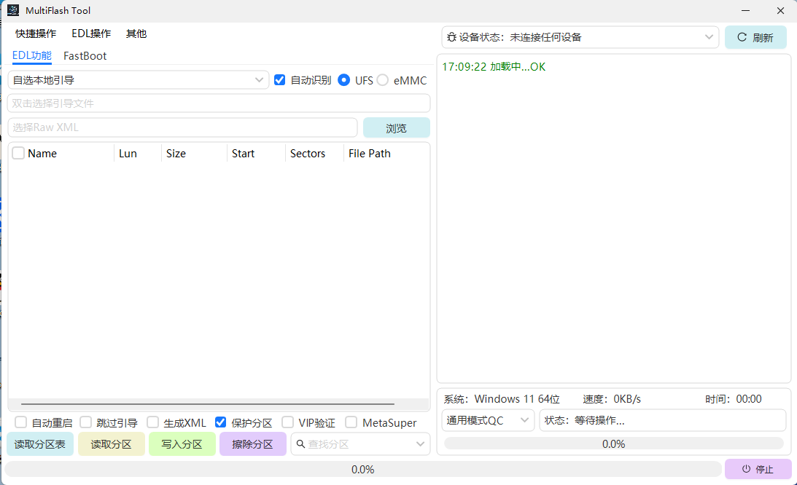

<div align="center">
  
  
  # MultiFlash Tool
  
  **An Open-Source Multi-Function Android Flashing Tool**
  
  Supports Qualcomm EDL (9008) Mode and Fastboot Mode
  
  [](https://creativecommons.org/licenses/by-nc-sa/4.0/)
  [](https://dotnet.microsoft.com/)
  [](https://www.microsoft.com/windows)
  [](https://github.com/xiriovo/MultiFlash-Tool/stargazers)
  [](https://github.com/xiriovo/MultiFlash-Tool/network/members)
  
  [](https://github.com/xiriovo/MultiFlash-Tool/issues)
  [](https://github.com/xiriovo/MultiFlash-Tool/pulls)
  [](https://github.com/xiriovo/MultiFlash-Tool/releases)
  [](https://github.com/xiriovo/MultiFlash-Tool/releases)
  
  [中文文档](README.md) | English | [Quick Reference](docs/QUICK_REFERENCE.md)
  
</div>

---

## 📑 Table of Contents

- [License Notice](#license-notice)
- [Features](#features)
- [System Requirements](#system-requirements)
- [Quick Start](#quick-start)
- [Documentation](#documentation)
- [Tech Stack](#tech-stack)
- [FAQ](#faq)
- [Contributing](#contributing)
- [License](#license)
- [Contact](#contact)

## 🎯 Project Highlights

<table>
  <tr>
    <td align="center">
      <h1>🚀</h1><br>
      <b>Efficient & Stable</b><br>
      Optimized flashing<br>Resume support
    </td>
    <td align="center">
      <h1>⚡</h1><br>
      <b>Easy to Use</b><br>
      GUI interface<br>One-click operation
    </td>
    <td align="center">
      <h1>🛠️</h1><br>
      <b>Full-Featured</b><br>
      EDL + Fastboot<br>Firmware toolkit
    </td>
    <td align="center">
      <h1>📖</h1><br>
      <b>Open Source</b><br>
      Fully open<br>Active updates
    </td>
  </tr>
</table>

## 📸 Screenshot

<div align="center">
  
  <p><i>MultiFlash Tool Main Interface</i></p>
</div>

## ⚠️ License Notice

This project is licensed under **CC BY-NC-SA 4.0** (Creative Commons Attribution-NonCommercial-ShareAlike 4.0). **Any form of commercial use is prohibited.**

- ❌ No selling
- ❌ No use in commercial products
- ❌ No use for profit
- ✅ Free for learning and research
- ✅ Can be modified and distributed (must maintain same restrictions)

## ✨ Features

### Core Functions

- 📱 **Smart Device Detection**
  - Auto-detect ADB/Fastboot/EDL devices
  - Real-time device status monitoring
  - Multi-device management

- 🔧 **EDL Mode Flashing**
  - Support Qualcomm 9008 mode flashing
  - Sahara protocol communication
  - Firehose protocol flashing
  - GPT partition table backup/restore
  - Memory read/write operations

- ⚡ **Fastboot Enhancement**
  - Partition read/write operations
  - OEM unlock/relock
  - Device information query
  - Custom command execution

- 📦 **Firmware Tools**
  - Payload.bin extraction
  - Super partition merge
  - Sparse image handling
  - Partition image extraction

### Advanced Features

- 📝 **Detailed Logging** - Operation log recording and export
- 🌐 **Multi-language Support** - Chinese & English interface
- 🎨 **Modern UI** - Based on AntdUI framework

## 📋 System Requirements

### Minimum Configuration
- **Operating System**: Windows 10 (64-bit) or higher
- **Runtime**: .NET Framework 4.8 or higher
- **Memory**: 4GB RAM
- **Storage**: 500MB available space

### Driver Requirements
- **Qualcomm EDL Driver**: For 9008 mode (required)
- **ADB Driver**: For ADB debugging
- **Fastboot Driver**: For Fastboot mode

## 🚀 Quick Start

### Installation Steps

1. **Download Program**
   - Download latest version from [Releases](../../releases) page
   - Extract to any directory (English path recommended)

2. **Install Drivers**
   - Install Qualcomm EDL driver (9008 mode)
   - Install ADB and Fastboot drivers

3. **Run Program**
   ```
   MultiFlash Tool.exe
   ```

4. **Connect Device**
   - Connect device via USB
   - Program will auto-detect device type
   - Select corresponding operation mode

### Usage Examples

#### EDL Mode Flashing
1. Device enters 9008 mode
2. Select Programmer file (.mbn/.elf)
3. Select firmware package or partition image
4. Click "Start Flashing"

#### Fastboot Operations
1. Device enters Fastboot mode
2. Select partition to operate
3. Execute read/write/erase operations

#### Payload Extraction
1. Select OTA package (.zip)
2. Select output directory
3. Click "Extract Payload"

## 📚 Documentation

### Core Documents
- **[Quick Reference Guide](docs/QUICK_REFERENCE.md)** ⭐ - Quick operation manual
- **[Development Guide](DEVELOPMENT.md)** - Project structure and development standards
- **[Contributing Guide](CONTRIBUTING.md)** - How to contribute to the project
- **[Changelog](CHANGELOG.md)** - Version update history

### Additional Documents
- **[Contact Information](docs/CONTACT_INFO.md)** - All contact channels
- **[Screenshots & Demos](docs/SCREENSHOTS.md)** - Interface preview and video tutorials
- **[Documentation Improvements](docs/DOCUMENTATION_IMPROVEMENTS.md)** - Documentation history

## 🤝 Contributing

Issues and Pull Requests are welcome!

### How to Contribute
1. Fork this repository
2. Create feature branch (`git checkout -b feature/AmazingFeature`)
3. Commit changes (`git commit -m 'Add: some feature'`)
4. Push to branch (`git push origin feature/AmazingFeature`)
5. Submit Pull Request

See [CONTRIBUTING.md](CONTRIBUTING.md) for complete contribution guidelines.

## 🛠️ Tech Stack

- **UI Framework**: [AntdUI](https://gitee.com/antdui/AntdUI) 2.2.1
- **Compression**: SharpZipLib 1.4.2
- **JSON**: System.Text.Json 8.0.5 / Newtonsoft.Json 13.0.4
- **Protobuf**: Google.Protobuf 3.17.3
- **Encryption**: Fody / Costura

## ❓ FAQ

### Device Not Detected?
- Check if drivers are correctly installed
- Try different USB port
- Confirm device is in correct mode

### EDL Mode Flashing Failed?
- Confirm Programmer file matches device
- Check firmware package integrity
- Review log files for errors

### Permission Denied?
- Run program as administrator
- Check if antivirus software is blocking

## ⚠️ Disclaimer

**Using this tool carries risks and may brick your device or cause data loss.**

- ⚠️ Always backup important data before operations
- ⚠️ Understand the risks of flashing operations
- ⚠️ Improper operations may prevent device from booting
- ⚠️ This tool is for learning and research purposes only

**Developers are not responsible for any losses caused by using this tool.**

## 📄 License

This project is licensed under **[CC BY-NC-SA 4.0](https://creativecommons.org/licenses/by-nc-sa/4.0/)** - see [LICENSE](LICENSE) file

- ✅ **Share** — Copy and redistribute in any medium or format
- ✅ **Adapt** — Remix, transform, and build upon the material
- ⚠️ **Attribution** — Must give appropriate credit
- ⚠️ **ShareAlike** — Must use the same license for derivatives
- ❌ **NonCommercial** — No commercial use allowed

## 🌟 Star History

If this project helps you, please give it a Star ⭐

## 📧 Contact

### Issue Reporting
- **Bug Report**: [GitHub Issues](../../issues/new?template=bug_report.md)
- **Feature Request**: [GitHub Issues](../../issues/new?template=feature_request.md)
- **Discussions**: [GitHub Discussions](../../discussions)

### Community
- **QQ Group**: [MultiFlash TOOL](https://qm.qq.com/q/oCwGmTm5a2)
- **Telegram**: [OPFlashTool](https://t.me/OPFlashTool)
- **Discord**: [Join Server](https://discord.gg/your-invite) <!-- Replace with actual Discord link -->

### Developer Contact

<table align="center">
  <tr>
    <td align="center" width="150">
      <a href="https://github.com/xiriovo">
        <br>
        <sub><b>xiriovo</b></sub>
      </a><br>
      <a href="https://github.com/xiriovo">GitHub</a><br>
      <span>QQ: 1708298587</span>
    </td>
    <td align="center" width="150">
      <a href="https://github.com/Love-suannai">
        <br>
        <sub><b>Love-suannai</b></sub>
      </a><br>
      <a href="https://github.com/Love-suannai">GitHub</a><br>
      <span>QQ: 2863581329</span>
    </td>
  </tr>
</table>

- **Email**: 1708298587@qq.com

### Follow Us
- **GitHub**: [Star this project](https://github.com/xiriovo/MultiFlash-Tool)
- **Gitee Mirror**: [China Mirror](https://gitee.com/xiriery778/MultiFlash-Tool) <!-- Uncomment if mirror exists -->

> 💡 **Tip**: Please check [FAQ](#faq) and [existing Issues](../../issues) before asking questions

---

<div align="center">
  Made with ❤️ by MultiFlash Tool Team
  <br>
  Copyright © 2025 MultiFlash Tool Team. Licensed under CC BY-NC-SA 4.0.
</div>
